# 混元形译：A C-like-compiler
同济大学CS《编译原理》课程设计: 类C语言编译器TongJi University CS compiler theory assignment

## 概述

本项目是为2021年同济大学计算机系编译原理课程设计。实现了类C语言编译为MIPS的汇编器。

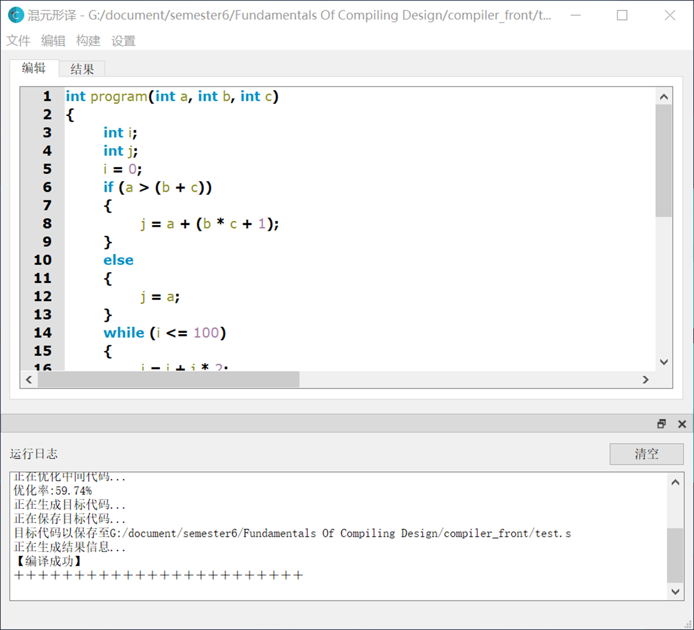

### 程序功能

1. 程序具有图形界面，包含简单的编辑器，可以让用户非常方便地编辑类C语言文件。编辑器还具备一定的辅助功能，具体包括：显示代码行号、高亮关键字、高亮变量名、区分注释内容以及一定的自动补全功能。编辑器还支持全选、复制、粘贴、撤销、重做等常见的编辑操作。

2. 程序具有较为完善的文件操作。可以让用户新建文件、打开本地文件、将修改后的文件保存或者另存为。当用户在编辑器内对文件进行修改且文件尚未保存时，程序会在标题栏内用 * 号提示文件尚未保存，此时用户关闭程序或者打开新文件时，程序会弹出文件尚未保存的提示，以免用户误操作。除此以外，程序的大部分操作功能都有快捷键对应，提高了使用效率。

3. 程序可以对类C语言代码编译，支持函数过程调用和数组。编译完成后会在原文件路径下生成汇编语言代码文件并在运行日志中输出对应的编译信息或者发生编译错误时的错误提示信息。此时用户可以查看详细的编译过程和结果。具体包括：词法分析阶段的单词符号串和符号表；语法分析阶段生成的LR(1)分析表、语法分析过程和生成的语法树；语义分析阶段的符号地址表和生成的中间代码；优化阶段的基本块划分和优化后的中间代码；目标代码生成阶段的待用活跃信息表、寄存器分配过程以及最终的MIPS汇编程序。

4. 程序的编译功能较为完备，除了支持最基本的C语言文法外还支持函数过程调用、支持多维数组。支持编译常见的C语言算法，例如递归算法、动态规划算法等。此外本程序还使用DAG图实现了局部优化，取得了明显的优化效果。

### 程序输入

1. 文法文件：该文件是程序的配置文件，与可执行程序在同一目录下，具有只读属性。

2. 类C语言代码文件：程序接收的被编译文件，该文件可由程序中的编辑器创建并保存。

### 程序输出

1. 程序运行日志：显示程序相关信息、程序编辑的过程信息或者编译出错的提示信息、目标代码文件的保存路径。

2. 程序编译过程展示：通过表格、图形、文字详细展示编译每一步中的工作过程和工作结果。

3. 目标代码文件：编译完成的MIPS汇编代码，可在MARS汇编器上运行。

## 备注:star:

本学期最费劲的大作业，从开学开始做，整个三月把后端搞定，之后又花了小一个礼拜搞定了前端。

如果本仓库有帮助到你，就送我一颗star吧🤗

如果有问题也可以在issue提出，方便其他人参考或一起讨论😋

## 设计

### 项目结构

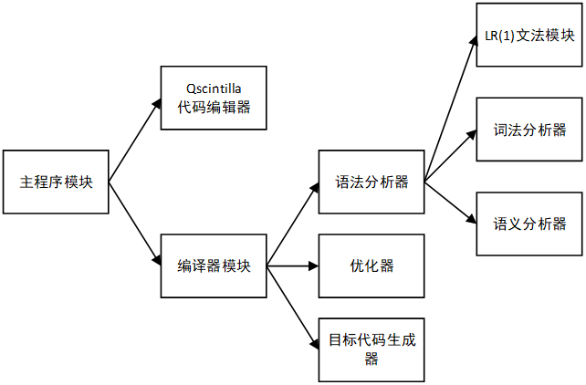

### 文法设计

#### 约定

所有非终结符用尖括号<>包含，所有终结符用单引号’’包含，产生式箭头用::=表示，文法中的第一个产生式的左部为文法的开始符号。

#### 文法符号

| 文法终结符 | AND        | ASSIGN | DEL   | ELSE    |
| ---------- | ---------- | ------ | ----- | ------- |
| 含义       | &&         | =      | ;     | else    |
| 文法终结符 | ID         | IF     | INT   | LB      |
| 含义       | ID         | if     | int   | {       |
| 文法终结符 | LP         | LS     | NOT   | NUM     |
| 含义       | (          | [      | !     | num     |
| 文法终结符 | OP1        | OP2    | OR    | RB      |
| 含义       | +-&\|^     | */     | \|\|  | }       |
| 文法终结符 | RELOP      | RETURN | RP    | RS      |
| 含义       | 比较运算符 | return | )     | ]       |
| 文法终结符 | SEP        | VOID   | WHILE | epsilon |
| 含义       | ,          | void   | while |         |
| 文法终结符 | #          |        |       |         |
| 含义       | 终止符     |        |       |         |

| 文法非终结符 | ACTUALPARAM    | ACTUALPARAMLIST | ARRAY           |
| ------------ | -------------- | --------------- | --------------- |
| 含义         | 实参           | 实参列表        | 数组            |
| 文法非终结符 | ARRAYASSERTION | ASSERTION       | ASSERTIONS      |
| 含义         | 数组声明       | 声明            | 声明组          |
| 文法非终结符 | ASSERTIONTYPE  | ASSIGNMENT      | B               |
| 含义         | 声明类型       | 赋值语句        | 辅助语义分析    |
| 文法非终结符 | BOOLAND        | BOOLNOT         | CALL            |
| 含义         | 与操作表达式   | 非操作表达式    | 函数调用        |
| 文法非终结符 | COMP           | CTRL            | EXPRESSION      |
| 含义         | 比较运算表达式 | 布尔表达式      | 表达式          |
| 文法非终结符 | FACTOR         | FORMALPARAM     | FORMALPARAMLIST |
| 含义         | 因子           | 形参声明        | 形参列表        |
| 文法非终结符 | FUNCASSERTION  | IFSEN           | INNERASSERTION  |
| 含义         | 函数声明       | 条件语句        | 内部声明        |
| 文法非终结符 | INNERVARIDER   | M               | N               |
| 含义         | 内部变量声明   | 辅助语义分析    | 辅助语义分析    |
| 文法非终结符 | PLUSEX         | PROGRAM         | RETURNSEN       |
| 含义         | 加法表达式     | 程序开始        | 返回语句        |
| 文法非终结符 | SENBLOCK       | SENSEQ          | SENTENCE        |
| 含义         | 语句块         | 语句串          | 语句            |
| 文法非终结符 | T              | TERM            | WHILESEN        |
| 含义         | 辅助语义分析   | 项              | 循环语句        |

#### LR(1)文法

```
<PROGRAM>::=<M><ASSERTIONS>

<M>::='epsilon'

<ASSERTIONS>::=<ASSERTION>|<ASSERTION><ASSERTIONS>

<ASSERTION>::='INT''ID'<ASSERTIONTYPE>'DEL'|<FUNCASSERTION><SENBLOCK>

<ASSERTIONTYPE>::='epsilon'|<ARRAYASSERTION>

<FUNCASSERTION>::='VOID''ID'<M>'LP'<FORMALPARAM>'RP'|'INT''ID'<M>'LP'<FORMALPARAM>'RP'

<ARRAYASSERTION>::='LS''NUM''RS'|'LS''NUM''RS'<ARRAYASSERTION>

<FORMALPARAM>::=<FORMALPARAMLIST>|'VOID'|'epsilon'

<FORMALPARAMLIST>::='INT''ID'|'INT''ID''SEP'<FORMALPARAMLIST>

<SENBLOCK>::='LB'<INNERASSERTION><SENSEQ>'RB'

<INNERASSERTION>::=<INNERVARIDEF>'DEL'<INNERASSERTION>|'epsilon'

<INNERVARIDEF>::='INT''ID'|'INT''ID'<ARRAYASSERTION>

<SENSEQ>::=<SENTENCE>|<SENTENCE><SENSEQ>

<SENTENCE>::=<IFSEN>|<WHILESEN>|<RETURNSEN>'DEL'|<ASSIGNMENT>'DEL'

<ASSIGNMENT>::='ID''ASSIGN'<EXPRESSION>|<ARRAY>'ASSIGN'<EXPRESSION>

<RETURNSEN>::='RETURN'<EXPRESSION>|'RETURN'

<WHILESEN>::=<B>'WHILE''LP'<CTRL>'RP'<T><SENBLOCK>

<B>::='epsilon'

<IFSEN>::='IF''LP'<CTRL>'RP'<T><SENBLOCK>|'IF''LP'<CTRL>'RP'<T><SENBLOCK>'ELSE'<N><SENBLOCK>

<CTRL>::=<EXPRESSION>

<T>::='epsilon'

<N>::='epsilon'

<EXPRESSION>::=<BOOLAND>|<BOOLAND>'OR'<EXPRESSION>

<BOOLAND>::=<BOOLNOT>|<BOOLNOT>'AND'<BOOLAND>

<BOOLNOT>::=<COMP>|'NOT'<COMP>

<COMP>::=<PLUSEX>|<PLUSEX>'RELOP'<COMP>

<PLUSEX>::=<TERM>|<TERM>'OP1'<PLUSEX>

<TERM>::=<FACTOR>|<FACTOR>'OP2'<TERM>

<FACTOR>::='NUM'|'LP'<EXPRESSION>'RP'|'ID'|<ARRAY>|'ID'<CALL>|'LP'<ASSIGNMENT>'RP'

<CALL>::='LP'<ACTUALPARAM>'RP'

<ARRAY>::='ID''LS'<EXPRESSION>'RS'|<ARRAY>'LS'<EXPRESSION>'RS'

<ACTUALPARAM>::=<ACTUALPARAMLIST>|'epsilon'

<ACTUALPARAMLIST>::=<EXPRESSION>|<EXPRESSION>'SEP'<ACTUALPARAMLIST>
```

### 详细设计

#### 词法分析器

词法分析器使用while和switch结构实现了一个状态机。首先把整个类C语言代码以字符串的形式存入字符串缓冲区中，然后词法分析器等待语法分析器调用，每一次调用都分析若干个字符并返回分析出的下一个单词符号串。

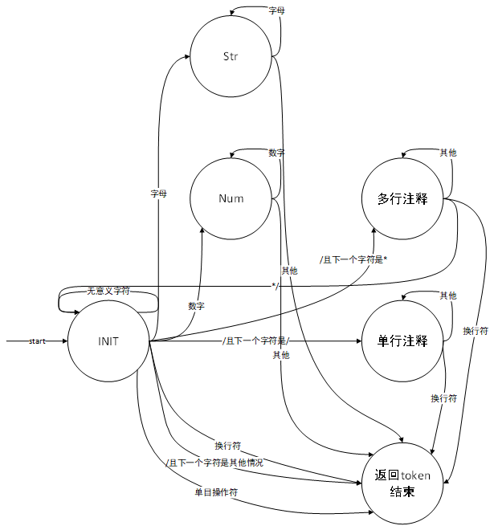

#### 语法分析器

语法分析器沿用上个学期的LR(1)文法。主要修改了对ε符号的处理：

上个学期直接修改类C语言文法，使其不含ε。这个学期在语义分析中必须要用到ε产生式以辅助运行空间组织与变量管理以及布尔表达式。为此修改语法分析器，使其忽略文法中的ε符号，当LR(1)分析失败时，尝试向输入串中加入ε进行规约，如果规约成功，代表使用了ε产生式，否则判定发生错误。

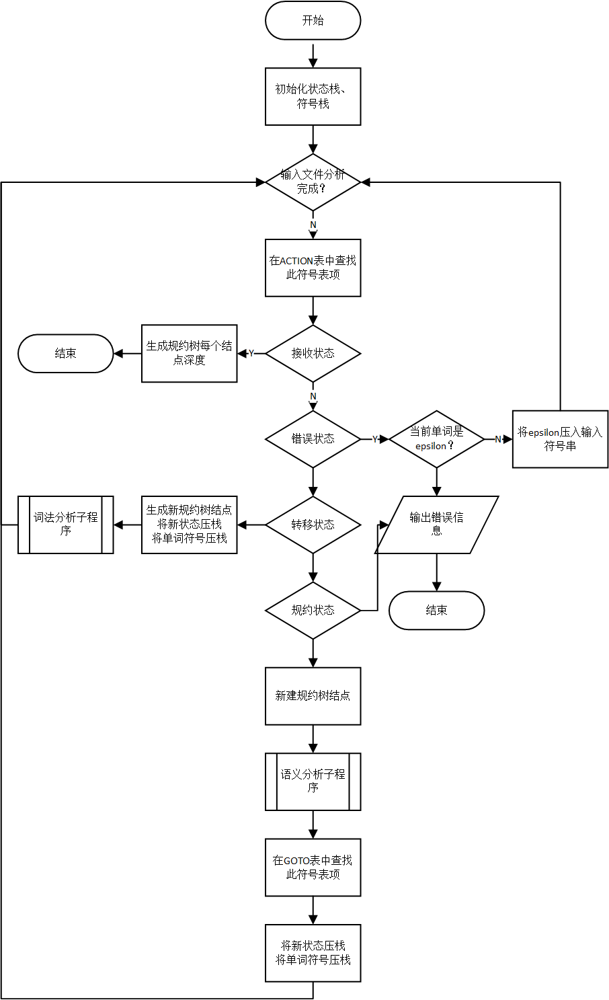

#### 语义分析器

语义分析器采用语法制导的翻译方式，作为一个子程序被语法分析器调用。每当规约动作发生时，语法分析器就调用语义的分析器中对应的产生式子程序，依附于规约树，完成程序运行空间管理、和中间代码生成的工作。

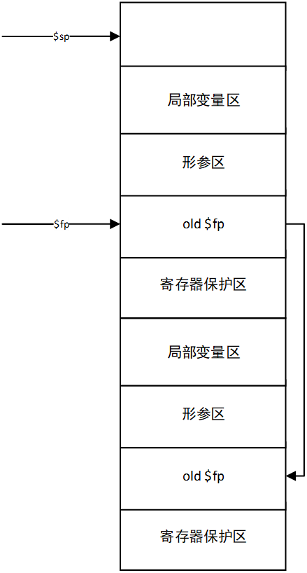

#### 优化器

划分基本块，使用DAG图进行局部优化。检查基本块内的哪些变量在其他基本块中还会用到，如果不会用到就删除生成该变量的中间代码。基本块划分算法和DAG图构建算法与课内所学相一致。

优化完成的中间代码长度缩减为原始代码长度的70%左右。


#### 目标代码生成器

1. 生成待用活跃信息表。

2. 生成汇编语言头部定义文件，具体包括对数据段，堆栈段，临时变量段的定义，定义异常，设置栈帧指针，跳转至主函数。

3. 然后以基本块为单位生成目标代码

4. 对于每一个基本块中的每一条中间代码，执行以下操作：
   1. 将源操作数的值载入寄存器，或者是直接获取装有源操作数的寄存器
   2. 针对每一种操作符，生成对应的中间代码，目的操作数的寄存器通过调用getREG函数获得，完成一条语句的生成后调用freshRA函数更新RVALUE表和AVALUE表

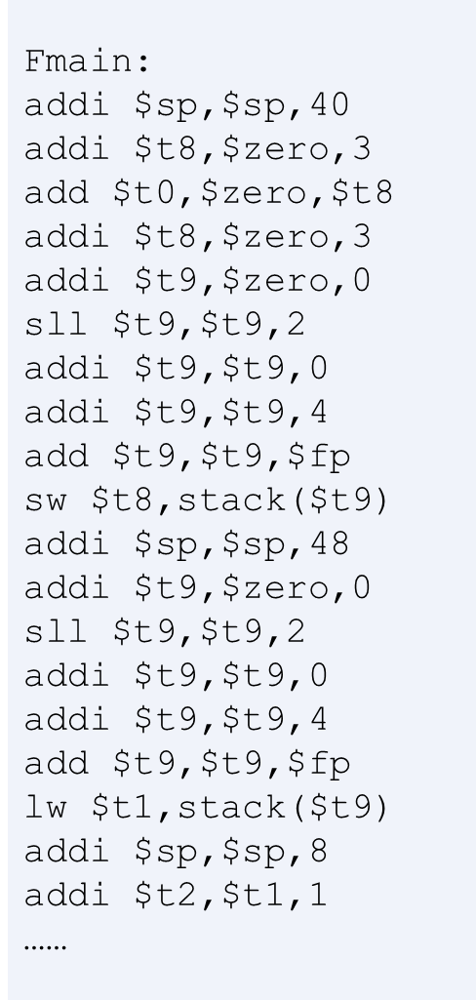

### 关键技术

#### 多维数组

- 数组按行存储

- 将数组元素的读写与普通变量的读写相一致

- 中间代码的数组变量记录了数组的起始地址

- 数组定义时栈帧寄存器要给数组开辟对应的空间

- 数组使用时，先计算数组元素的偏移量，然后偏移量与数组首地址相加，取相加结果作为要使用的内存单元地址

- 以上工作主要由语义分析程序完成

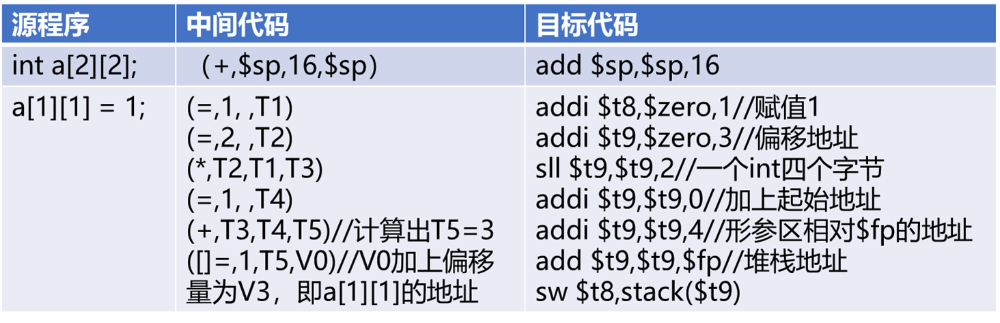

#### 函数调用

- 树状地址表实现局部变量

- 语义分析段安排好函数栈帧，函数内部变量的地址都以函数栈帧指针$fp为基准

- 函数调用过程中先保护现场，再构造被调用函数的栈帧，再压入形参

- 函数返回后要恢复栈帧，恢复被保存变量。函数的返回值由寄存器$v0传递

## 附录

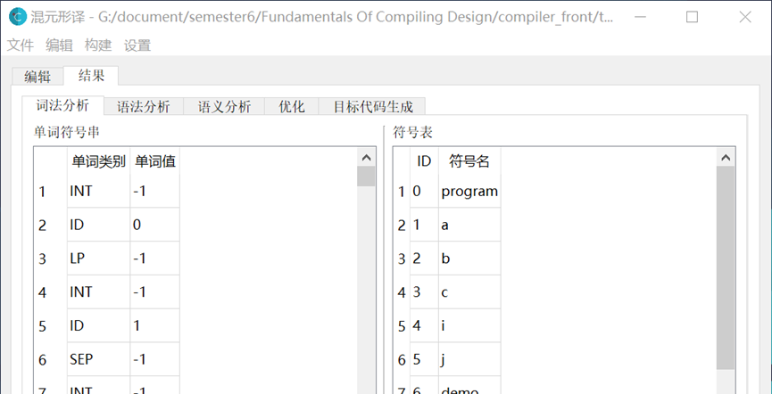

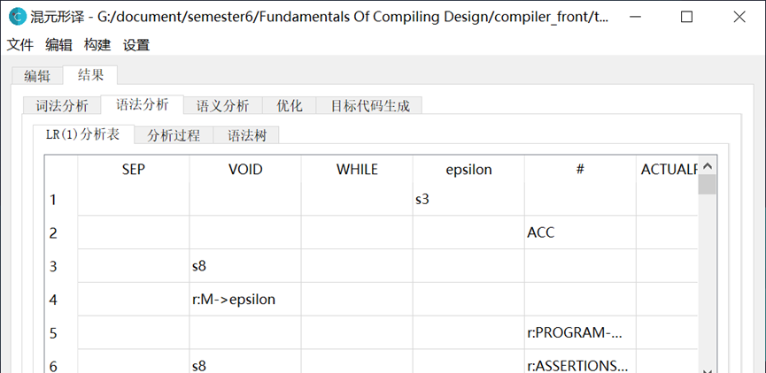

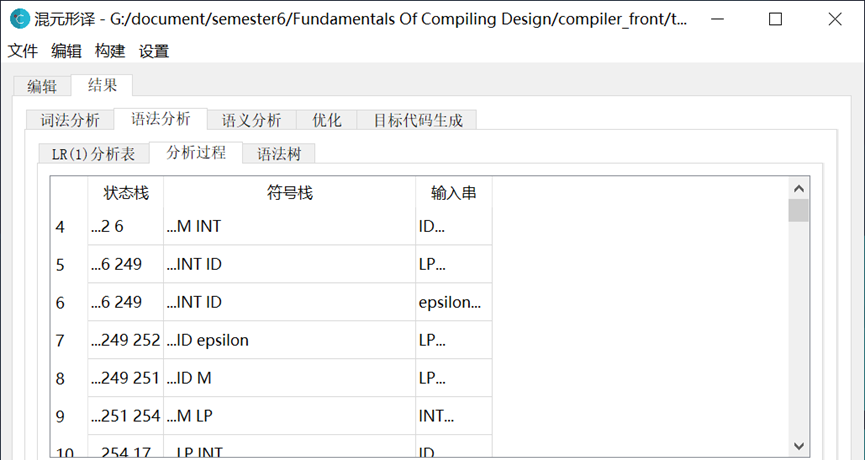

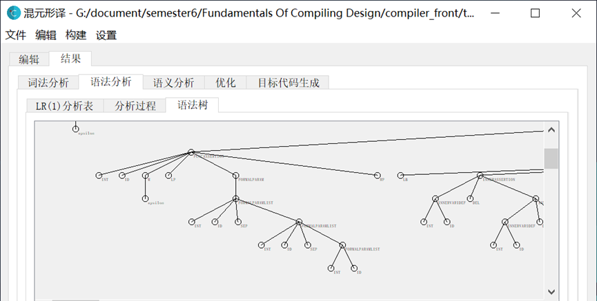

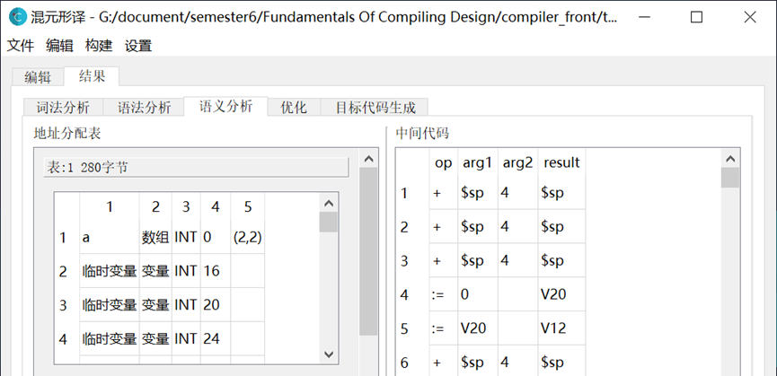

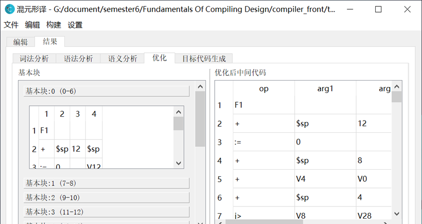

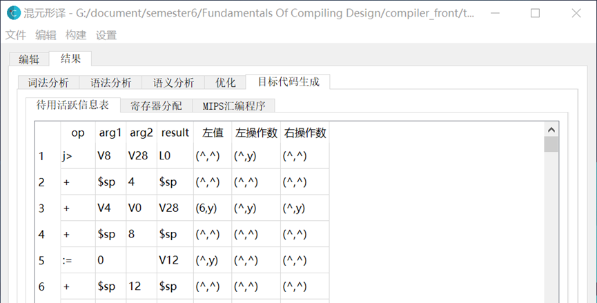

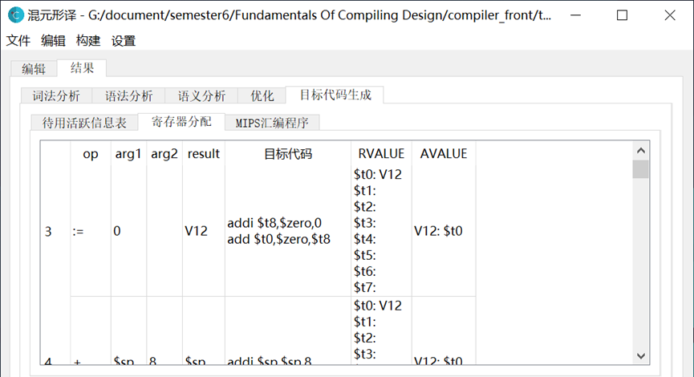

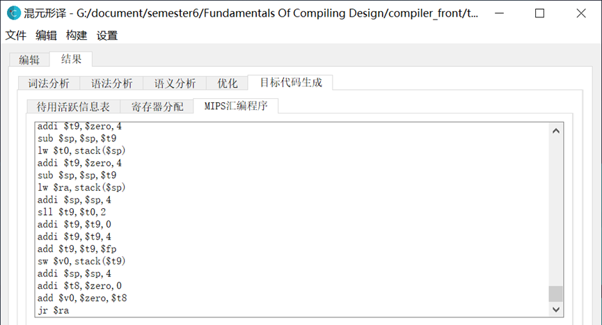
